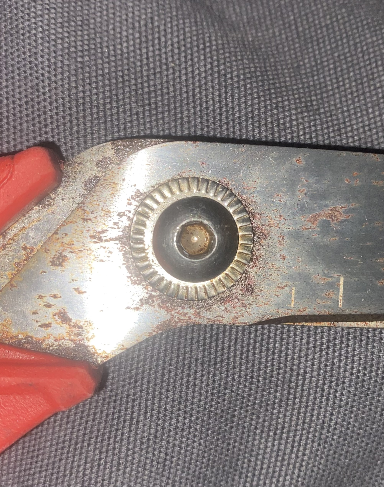
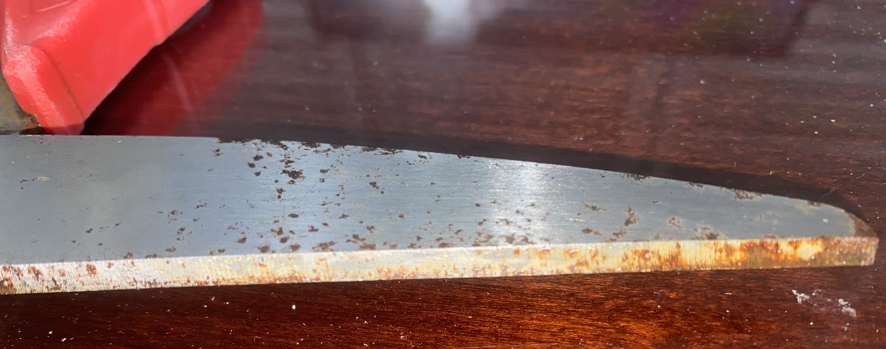

# A1 – Portfolio and product Analysis

## Objective
Our Objective is to Analyze the portfolios and determine if they satisfy the functional requirements to include navigability, reproducibility, evidence of reasoning, and professional tone to further our understanding of what a engineering portfolio is for. As well we will analyze a product and its constraints to better our skills of problem solving.

## Analyze

### Task A: Portfolio Analysis

## Portfolio #1: Thanh Tran - Mechanical Engineering Portfolio 
**Link:** [https://thanhvtran.com/]
**note:** This user was found through a search for mechanical engineering portfolios on the web.

#### Navigability
**Analysis:** The mechanical engineering portfolio for Thanh Tran has their experience/projects they have worked on located right on the homepage after scrolling down a short way. each project had a date to it which is when he worked on the project and each project that he did work on had a brief description as well as a link to find out more about the project.

#### Reproducibility
**Analysis:** With each piece of experience and work on the portfolio there was not enough information for reproducibility. However, there were a great number of pictures of the pieces of projects throughout its design/manufacture. There were few schematics and little drawings that could be used to reproduce.

#### Evidence of Reasoning
**Analysis:** The portfolio and its projects give brief overviews of the projects themselves and what was learned in that experience. There is not a lot of evidence that shows how decision were made for example why a material or shape was chosen for a project.

#### Professional Tone
**Analysis:** The entire portfolio contained a professional tone that would be appropriate for employers to look at. One piece to highlight that he also provided his resume with a large link to view. The resume contained professional language that employers are looking for in candidates.

## Portfolio #2: Zach Quinn - Professional Portfolio 
**Link:** [https://github.com/Zachlq/Professional_Portfolio]
**note:** This user was found through Github on a search for engineering portfolios.

#### Navigability
**Analysis:** The engineering portfolio for this page was navigable in a way. It was a fairly short portfolio that did include links to projects that were worked on but the lings were in text with a description of the link. A more advantageous approach to this would be to create standalone links that also act as titles to give viewers a clearer experience at what they are looking at. For the projects I did have to make an account to read about them which can make it more difficult for employers, colleagues, and other viewers.

#### Reproducibility
**Analysis:** There was little reproducibility of the projects, most of the projects contained information about the how and why of the project. There was little to no pictorial evidence of the projects which would make it difficult to reproduce.

#### Evidence of Reasoning
**Analysis:** The decisions that were made were clear and the projects weren't just about the final answer. There was a lot of detail in the strategies that were taken to make informed decisions. One other piece of information to take note upon is there was clear approach to each action for example a problem was stated and the steps that were followed by it.

#### Professional Tone
**Analysis:** The portfolio contained a picture with a dog and there was no resume on the site. This would not be appropriate for employers to look at and there were some formatting changes to the text/links to present it in a much more professional manner.

---

### Task B: Product Analysis
#### Product: Milwaukee tool Jobsite Offset Scissors

#### a. Primary Function
**Function:** 
The primary function of the Milwaukee offset scissors is to take the force applied on the handle and utilize two metal blades to apply a shear force to a material as they are brought together.

#### b. Governing Model
**Model:**
The governing physical equation is moment where moment equals the force (F) multiplied by the distance (d). From this we are able to find the force of the cut by taking the measured from from our hand and multiplying it by our distance from our hand to the fulcrum divided by the distance from the blade to the fulcrum.

**Variables:**
Force from blade: The output of force from the blades onto the object/material
Force from hand: The force applied from an individuals hand
Distance from handle to fulcrum: The measured distance from the handle loops to the fulcrum of the scissors
Distance from blade to fulcrum: The distance from the fulcrum to the point of an object or material it is applying force upon

**Assumption:**
We can assume that the force applied is proportional to the output force and the distance for the blade to the object being cut is inversely proportion which allows us to use less force on an object in order to apply a shearing force to the object.

#### c. Components
##### Component 1: Handle 

**Function:** With the handle being offset from the blade it allows the pair of scissors to be opened a greater distance.
##### Component 2: Fulcrum 
**Function:** The function of the fulcrum is gives the product the necessary ability to be open and closed while still holding together tight enough to apply a shear force to an object. 
##### Component 3: Blade 
**Function:** As you can see the blades are offset to a point which gives us a shearing force that can be applied closely together and on an almost colinear axis

#### d. Patent Research
**Patent Number:** US20140360025A1
**Authors:** Steven W. Hyma, Michael S. Steele, Matthew W. Naiva, Justin Ferrante

**Alternative Solutions:**

1. One solution to solve the products function is to shift the fulcrum closer to the blades and farther from the the handle loops to give us a larger force on the object the force is applied to with less work done.

2. Another solution to solve the products function is to place a spring between the handles giving us the ability for the the scissors to open up after making a cut and allowing us to get the object closer to the fulcrum thus using less force from the user to to cut the object.

**Design Decision Analysis:**
I think it is clear that the original engineer(s) decided to make a large angle offset on the handle and blade. This was most likely done to increase comfort for users but also make the function more advantageous by allowing the scissors to be opened up more in the same motion as a pair of straight scissors would.

## Decide
### 1. Homepage Identity
This homepage needs to show what projects are currently being executed, revised, and completed. There needs to be links to descriptions of those projects with drawings and the processes used in the projects. Additionally there needs to be a clear about me and resume link that is easy for employers and colleagues to be able to navigate to if they are interested. The homepage should professionally formatted in a manner that is appropriate and contains content like pictures and videos that make viewers want to explore my work.

### 2. One Intentional Customization
One intentional customization that I changed is my headings/links. I want viewers to have a simplistic yet informative experience while looking at my portfolio and by having my projects, about me, resume, and contacts all easily accessible this will encourage more interaction and connections.

### 3. Document Standard
All material completed with be to the fullest quality and extent this includes technical data and calculations provided as well as schematics/drawings for projects as required for viewers to fully understand what the clear analysis, strategy, and solution is.

## Communicate
