# A2 – Truss Stress Analysis

## Objective
The objective of this assignment was to design a truss with various external forces acting on different points. What we wanted to do besides just designing a truss was to view the internal forces, shear stress, and weight within our truss. Additionally our objective was to model our design through CAD to compare our model on paper to that on an application.

### Design Requirements
The design requirements were to design a truss given the points B(roller), A(pin), C, and D. Additionally there was an external force of 20kn acting on C upwards and a 20kn force acting on D downwards. a was a distance of 0.4 meters (m) and b was also a distance of 0.3m. I drew a quick diagram of the requirements to get a better understanding of the requirements along with an initial design. With my initial design of the truss I knew immediately that I wanted to incorporate triangles into the design while limiting the number of members to keep the amount of material low to minimize weight. The bottom of the image is the design of the truss I came up with. I added a joint which I named E to not only give me symmetry but to maintain a triangular geometry.

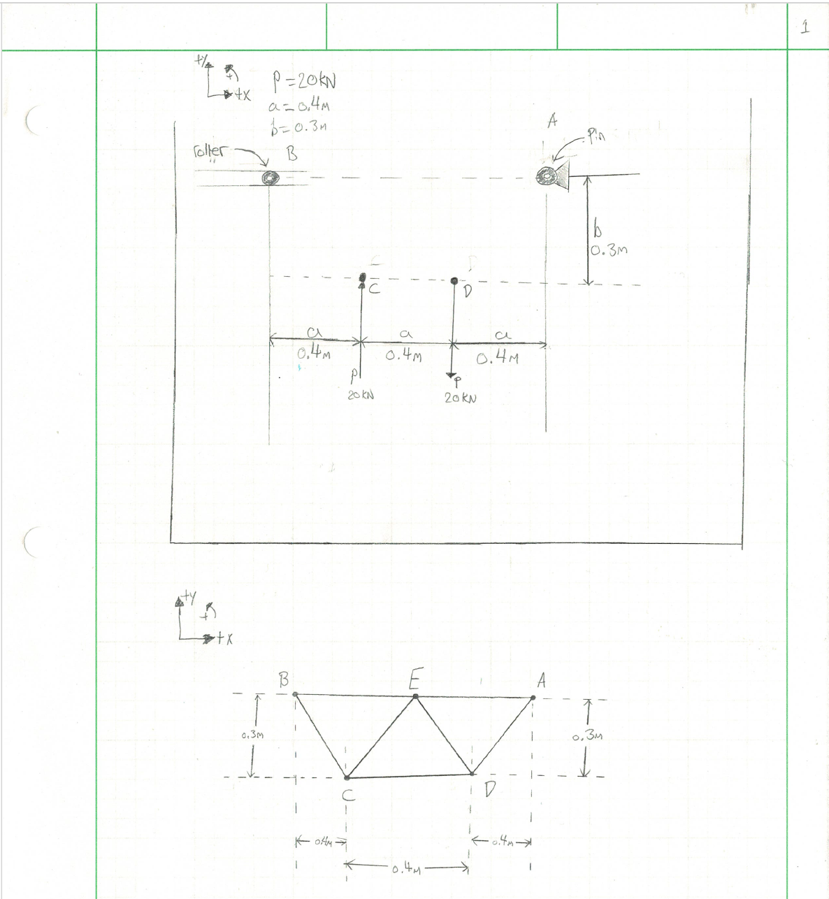

## Analyze
### Truss Free Body Diagram
The next step in my process was to start my analysis. I drew a free body diagram (FBD) of the truss and began to find the dimensions of all the members of the system. After finding the geometry of my truss I applied static equilibrium to the system to find my how the external forces acted on each of my joints.

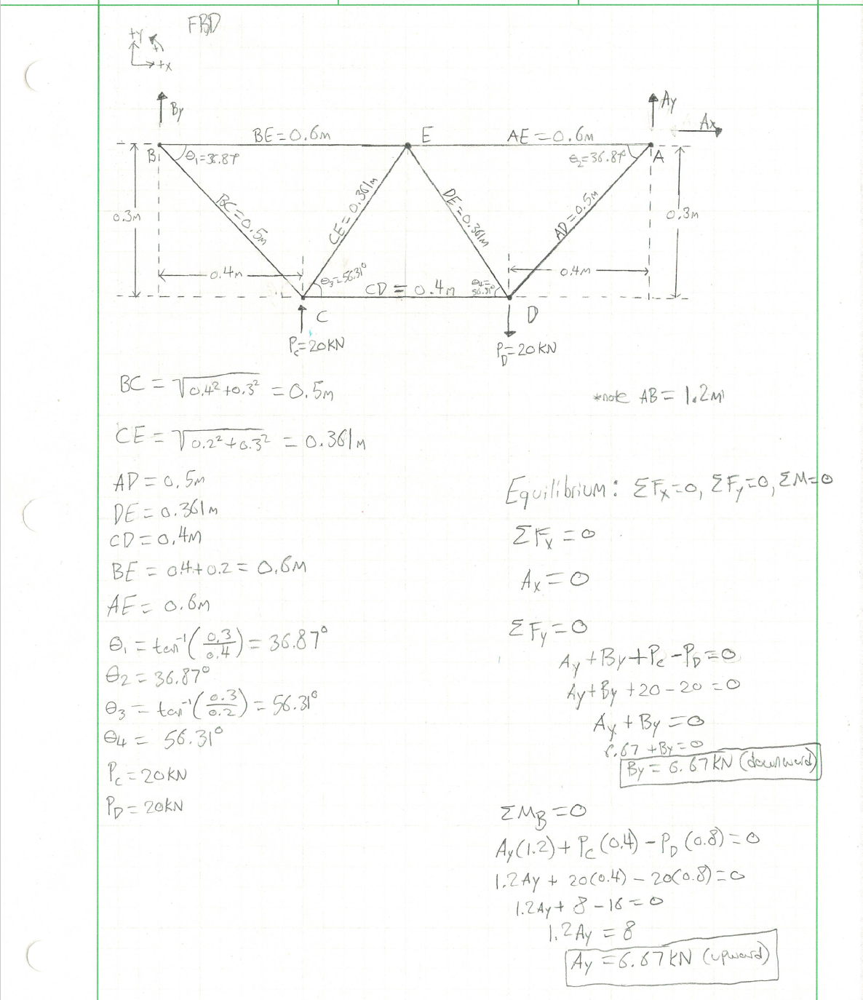

### Method of Joints
Once I found all of the required calculations for external forces on my truss design I then drew a FBD for each of the joints and found the forces by each member on their respective joint. The process was consisted of applying static equilibrium in the x and y direction for each joint and writing equations to solve for a single unknown variable after which I plugged in my known values to get numerical answers. Along with finding the value of these forces I was also able to determine whether the joints members were in compression or tension. Below are the calculations of all joints. At the end I included a final summary drawing of all the forces within my truss.

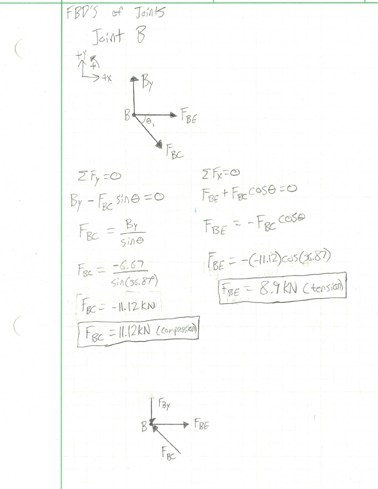
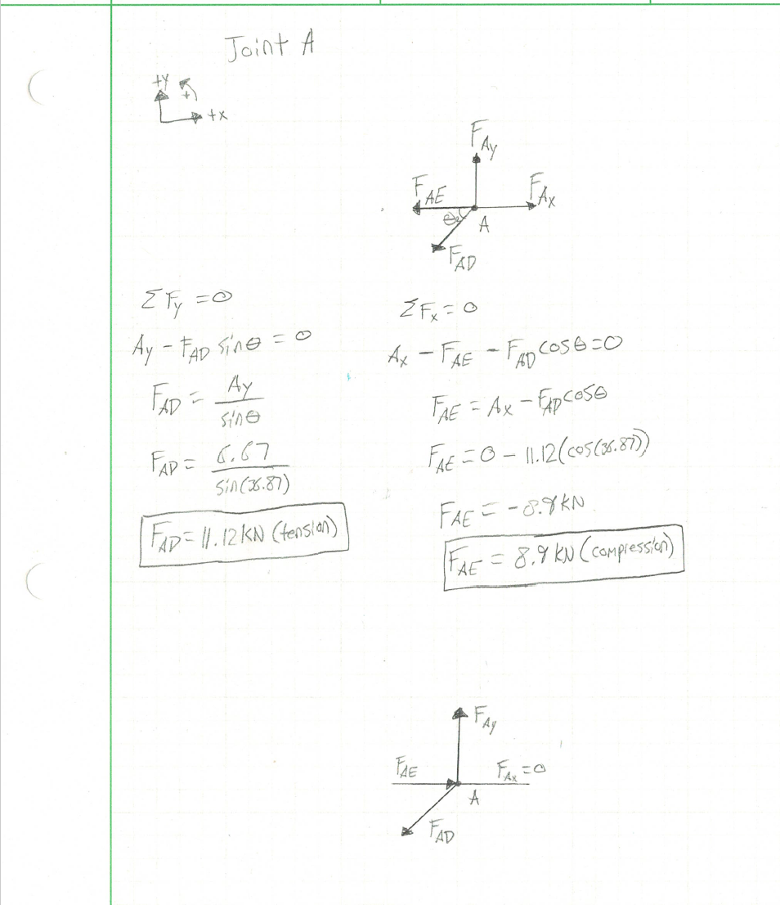
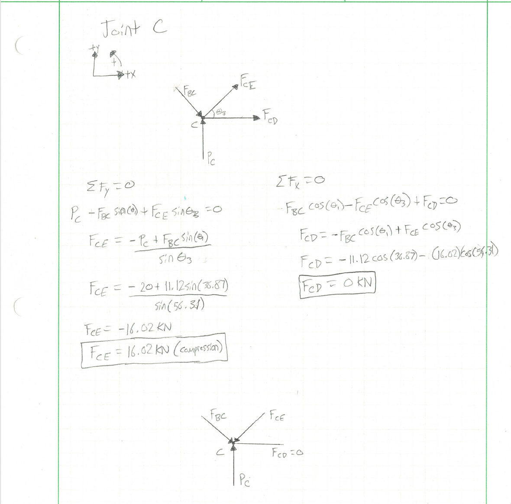
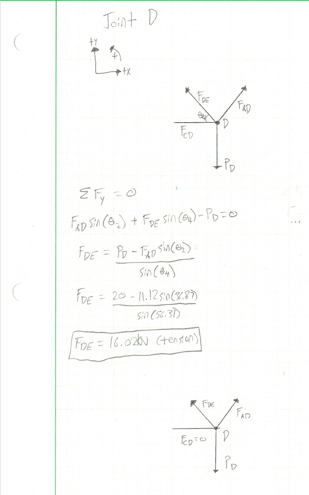
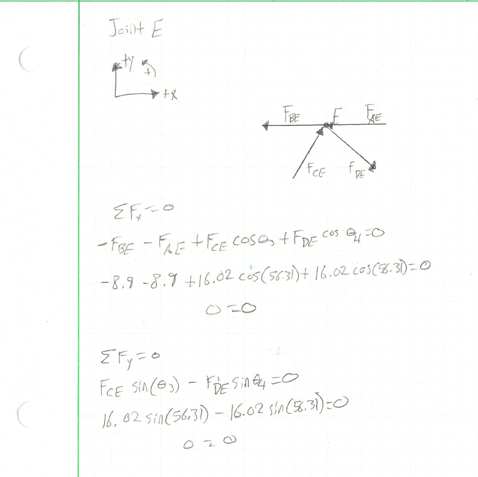
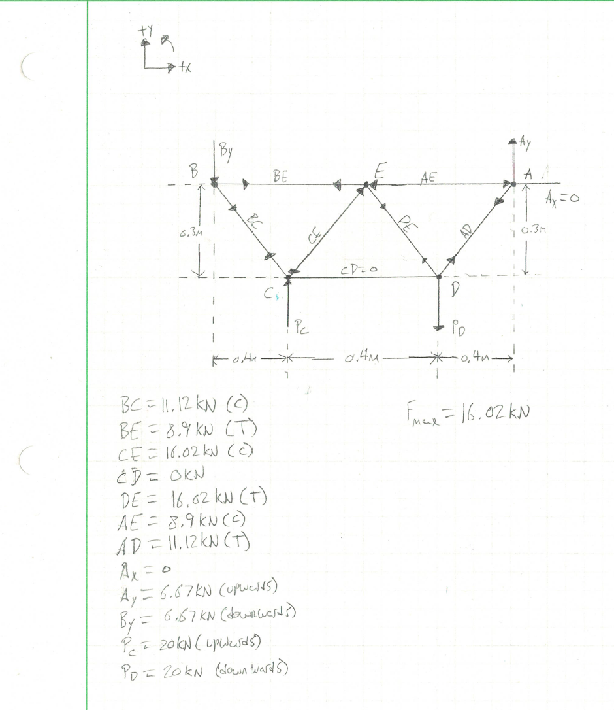

### Area of Members
Finding the cross sectional area of my members was the sequential step in the process. Now the design is starting to become more thought about in a three dimensional aspect. The safety factor requirement for the truss system was 3.5 and from our method of joints we found the max force of was 16.02kn. From previous instructions I was to use A500 Steel or a different type of metal depending on if the CAD application I was using had the metal. I knew ahead of time that I was planning to model the truss on Creo so I went ahead and opened it up and searched the materials catalog. A500 steel was not available so I decided to go with HSLA steel because of its tensile yield strength. Deciding on a metal for the truss at this point was critical because in order for me to determine the minimum area needed for my truss to meet the required safety factor I needed to know the tensile yield strength of the metal I was using. Also deciding this would give me the density for which I could also find the weight of the truss. like the previous calculations I algebraically solved for the minimum area needed and plugged in my values to get a minimum area of 148.3mm^2. I had a really hard time with this number and was constantly contemplating using this value because of the dimensions it gave me for the truss members. This really wasn't a requirement in this assignment but I began thinking about my manufacturing systems class and I thought about if I needed to make this truss system or order it from a manufacturer what would the cost, time, and possibility of making members with those dimensions would be. I decided to go with an area of 150mm^2 which minimally increased the overall weight of the truss. Once I determined the area of my members I found the volume of the system using the total length of the members I found earlier. Finding the volume and multiplying it by the density provided by creo for HSLA steel gave me the mass, then multiplying the mass by gravity (9.81) gave me a weight of 38.4N.

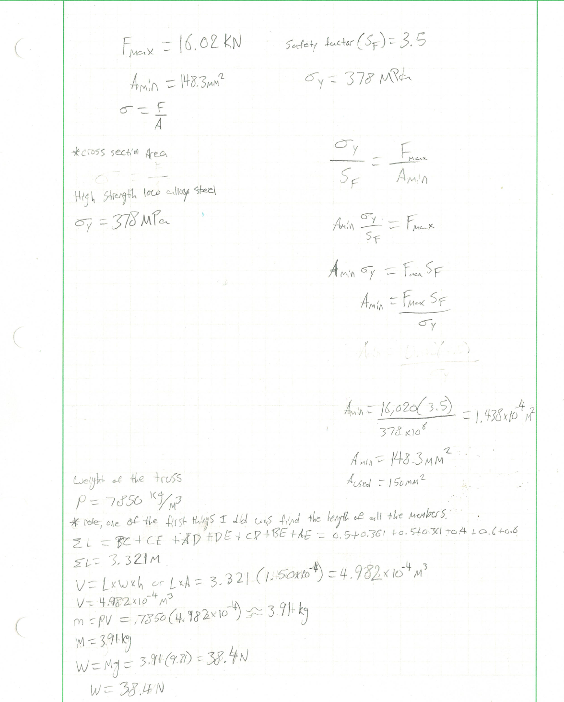

### Pin Design
Similar to the the truss I needed to design and analyze pins for the connections at the joints. For the pins they needed to be a single shear pin connection, all identical, and made of hardened tool stall that had a yield shear strength of 170ksi and density of 0.278lb/in^3. I had to create this material in creo with the given information. The caveat to the design of the pins is they needed to be calculated with a safety factor of 4. With the pins I drew a FBD of a pin with the appropriate force acting upon it and from this we were able to write an equation to solve for the minimum area of the pins. Since the pins were cylindrical I solved for the minimum diameter of the pins which came out to be 9.32mm. I was faced with a similar problem as before 9.32mm was a repeating decimal so for simplification I went for a pin with a diameter of 9.5mm and the length was 10mm. using the volume of the pins and multiplying it by the density gave me the mass and multiplying it by the gravity gave me the weight and multiplying by 5(pins) produced the weight of 0.268N.

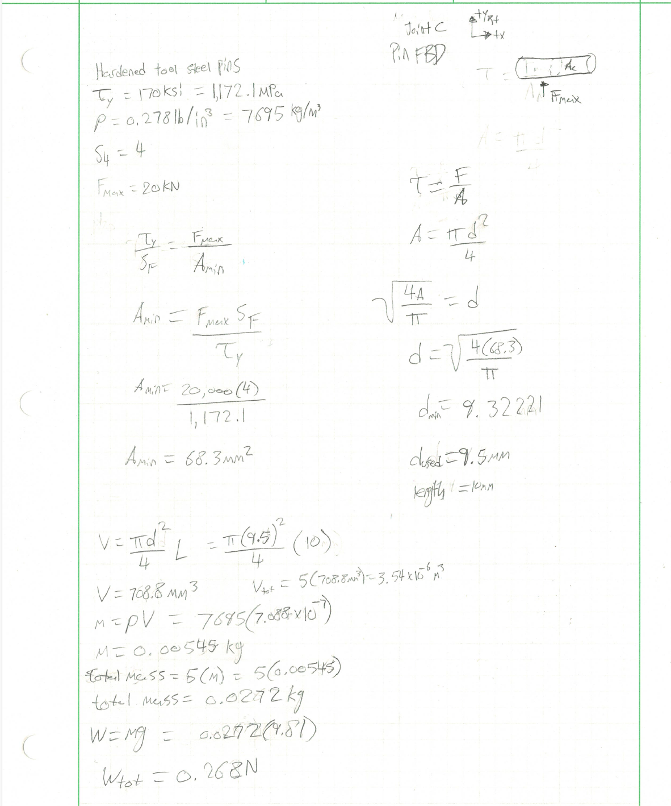

## Decide
_Which geometry did you select, and why? This is your first open design choice in the course — defend it._
### Geometry
I went with a triangular based geometry for the truss system because using a combination of triangles gives me the most stable truss system with the least amount of material. The triangular shapes provide strength and resistance to movement from external forces in the x and y direction. I talk about this in the joint design but using a circular shape for the joints allows for a better looking and stronger joint. no matter the angle at which the member comes in all joints have the same geometry.

### Joint Design
The joints were going to be the hardest part of the CAD process was going to be the joints and how the pins were going to fit in the joints, I had a cross sectional area of my members of 150mm^2 and the diameter of my pins were going to be 9.5mm. I decided to go with a 15mm tall x 10mm wide member to give myself a larger area for the pins. The ends were planned to be squared off ends but I soon realized that this would be aesthetically unappealing and I would not maintain the required cross sectional area at the joints. To adjust for this I decided to go with a circular joint with a center hole for the pins so no matter the angle the joints met they would have the same shape. To find the diameter of the circular joints I took the area of 150mm^2 and divided it by the width of 10mm and added the diameter of the pins to get a diameter of 24.5mm for the joints.

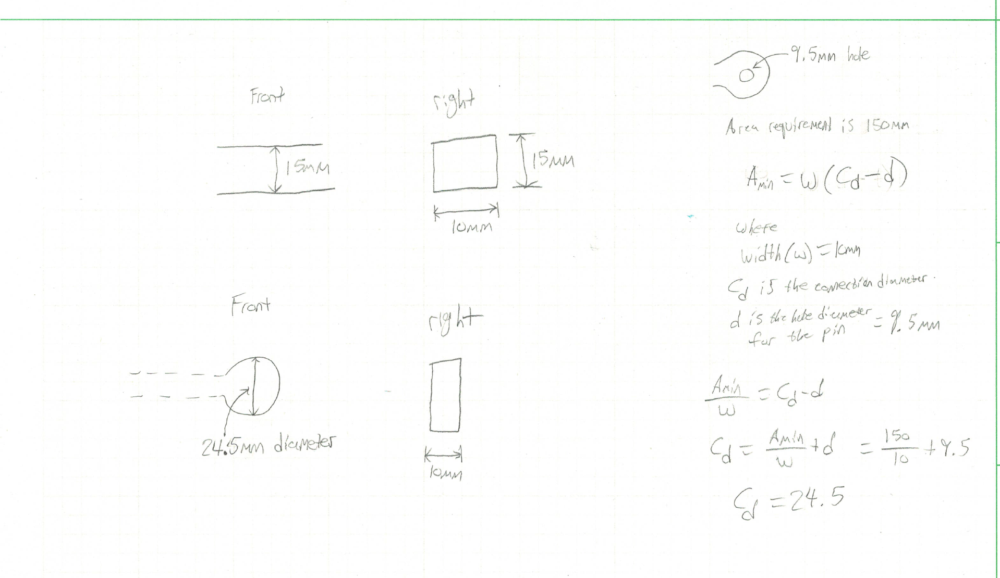

## Communicate
### First member
Here is the first member created in creo. This was the BE member with the right side centered at the origin becoming the point E. I did this to keep my truss symmetrical in creo, similar to what I created in all my hand drawings. I decided to make my measurements from center to center of the joints because I assumed that if it were an end to end measurement this would make all my other measurements of the members to have extra material.

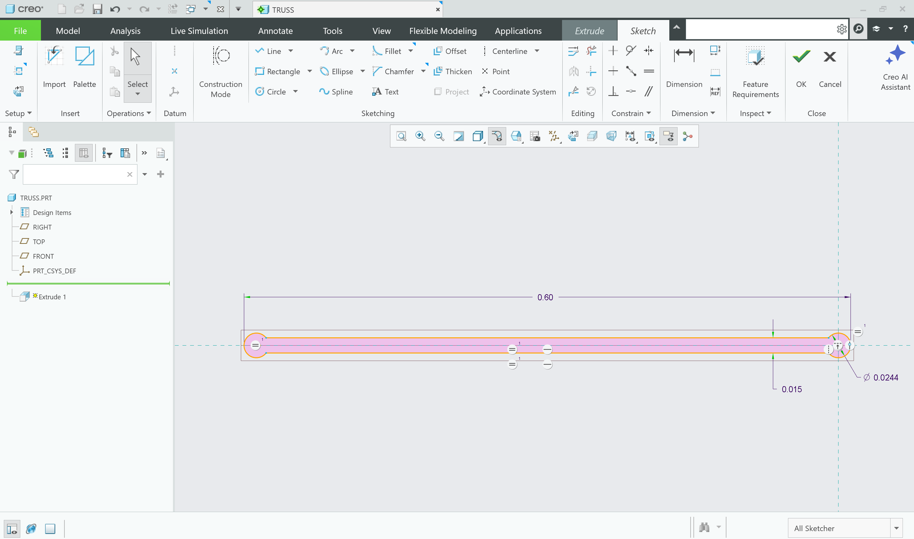
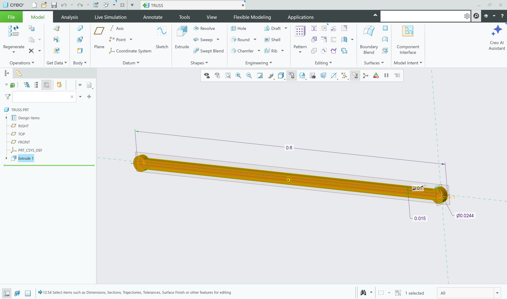

### Truss system CAD
I repeated the design for all other members until I was resulted with the final truss system as seen below. As you can see the connections all have a uniform circular shape. One thing to note is as I created each member as separate extrusions when I overlapped the members and extruded them creo automatically accounted for the overlapping material and created a joint that naturally came together.

### Pin in CAD
After completing the truss I created another file for the pins and began designing them to the specifications calculated previously. the diameter was 9.5mm with a length of 10mm. I created 4 identical pins with the same measurements and applied the tool steel material to the pins.

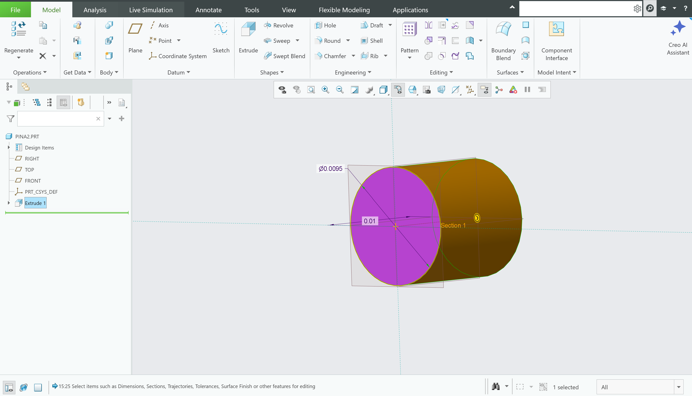
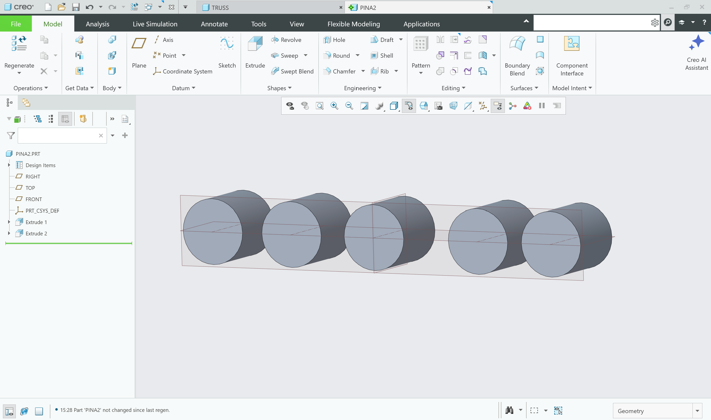

### Weight in CAD
As seen below are screenshots of the properties of the parts in CAD directly from creo. I also decided to do a comparison of the numbers of my calculations from analysis to those of the CAD model. You can see the total weight from my hand calculations is just above the total weight of my model. This could be because of the design of my joints and adding a little bit more volume which I did not calculate for in my hand calculations. However the numbers are within a few tenths and my hand calculation is slightly off compared to the CAD model.

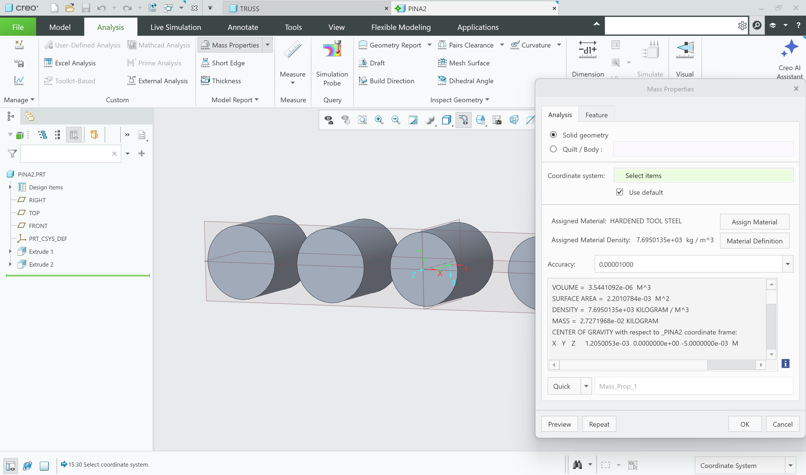
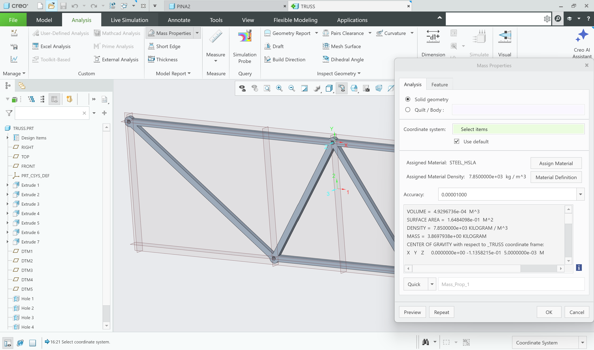
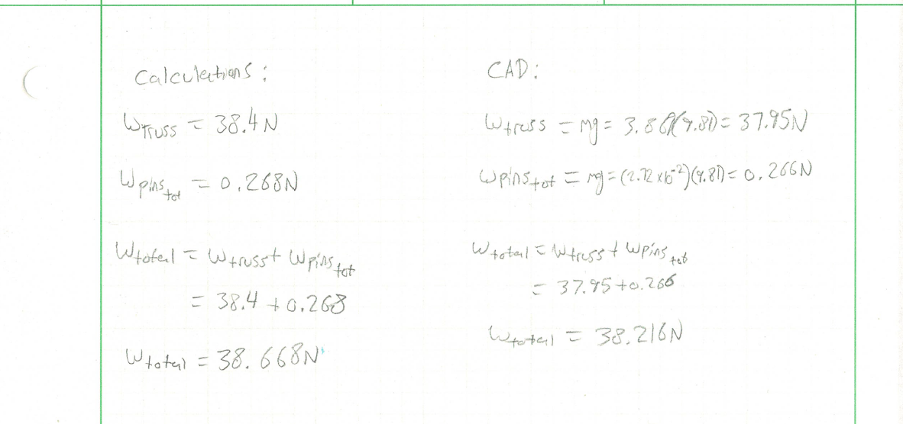

### Lessons learned
I think the biggest take away in this assignment was proper planning. Reading through the requirements of the entire design was crucial to me being able to complete it. I had to be mindful of the varying safety factor requirements and different materials used for both the pins and the truss. I also learned that so much of engineering is cumulative, because of my previous experience in statics and mathematics I was able to apply concepts like the method of sections to the truss to find max forces and static equilibrium in all my joints.

## Likelihood of different failure modes in truss components

### Truss members

#### Tension
For truss members in tension I looked at an analysis of a wooden truss that failed after being in place for over 100 years. The expected failure method of a truss member in tension is fracturing, especially if the material the truss member is constructed out of is wood, which is a brittle material when placed under tension. The reason for this is because over long periods of time with constant loads applied materials have creep "set in", which is essentially where a material is deformed slowly. As our material is deformed over time then that can lead to failure in members. In the case of the truss I was researching in the article, one simple design modification that could have been made was to simply use a metal instead of wood, that is the easy answer to the failure. However because wood is cheap and effective, metal might have not been an option so another modification could have been to brace the long spanning loads more periodically or but more vertical support pieces to disperse these huge triangles into smaller ones spreading forces equally.

Source: Duntemann, J. F., Kristie, R. J., Greve, B. R., & Hallman, D. J. (2003). Failure Analysis of 100-Year Old Timber Roof Truss. Forensic Engineering: Proceedings of the Third Congress, October 19–21, 2003, San Diego, California, 532–543. https://doi.org/10.1061/40692(241)52

#### Compression
I looked at a publication about truss members(concrete) in compression and I found that the the failure of these concrete truss members was buckling. Concrete is a brittle material when it is under compression. Using a concepts learned in materials we can say that when a material is loaded axially, the it will tend to transverse laterally. One of the design modifications we can make to a concrete truss in compression is reinforce it with metal so it is able to deform more elastically.

Source: Kiousis, P. D., Papadopoulos, P. G., & Xenidis, H. (2010). Truss modeling of concrete columns in compression. Journal of Engineering Mechanics, 136(8), 980–988. https://doi.org/10.1061/(ASCE)EM.1943-7889.0000142

### Pin connections
The expected failure mode of a pin is yielding. I read about the strength and properties of structural pins in a research document by David Duerr. In the document there was a test done on a series of varying diameter pins and some of the same diameter pins on the same area on which they were put through with a increasing force applied to them. From this data gathered when analyzing I found that pins of the same diameter but different plate area had nearly identical failure loads. The real difference was the pin diameter that made the difference in how much load the pin could have applied before failure. So when we look at reducing the failure under larger loads, instead of simply using larger pins which could impose a problem on what the size of the material the pins are being drove through. We can change the type of connection under which the pins are put, by incorporating a double pin connection in the design can allow for a smaller diameter pin to withstand a larger load.

Source: Duerr, D. (2025). Strength of round structural pins. Journal of Structural Design and Construction Practice, 30(1). https://doi.org/10.1061/JSDCCC.SCENG-1609

## Time spent
I spent approximately 12 hours working on this assignment.

## CAD Files
[Download the Truss Creo Part](./truss.prt.4)

[Download the Pin Creo Part](./pina2.prt.5)

