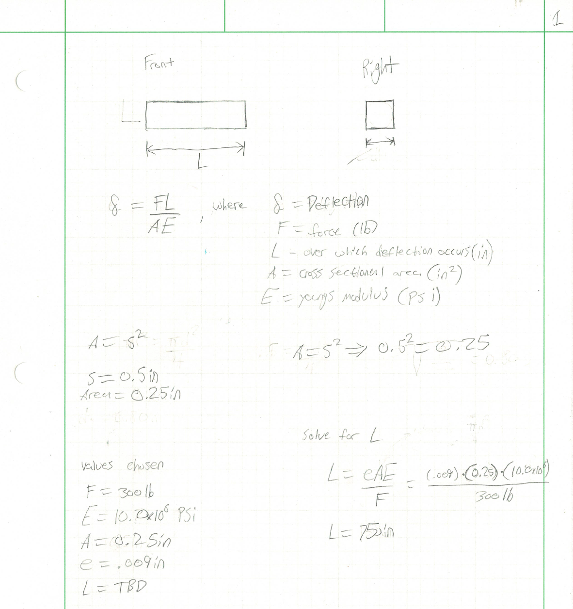
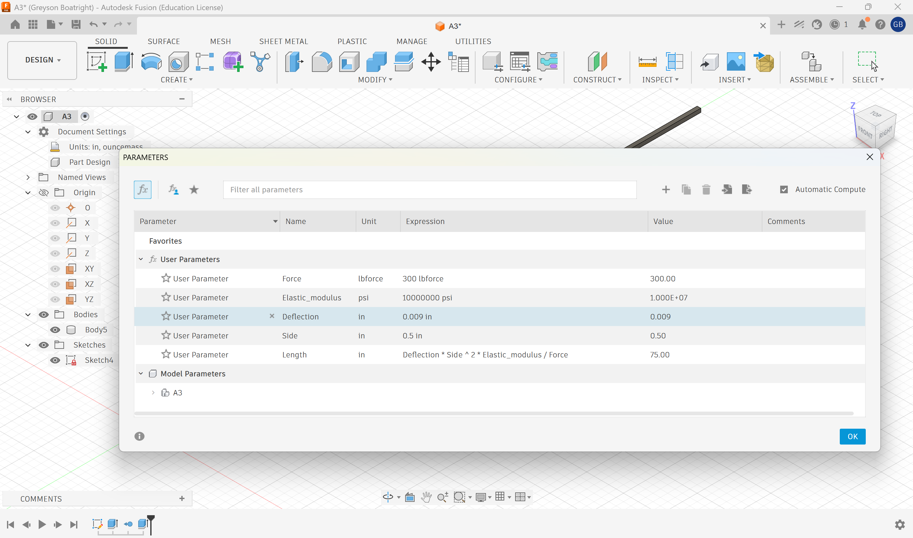
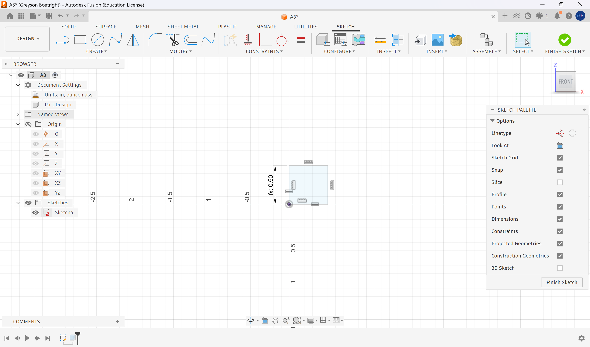
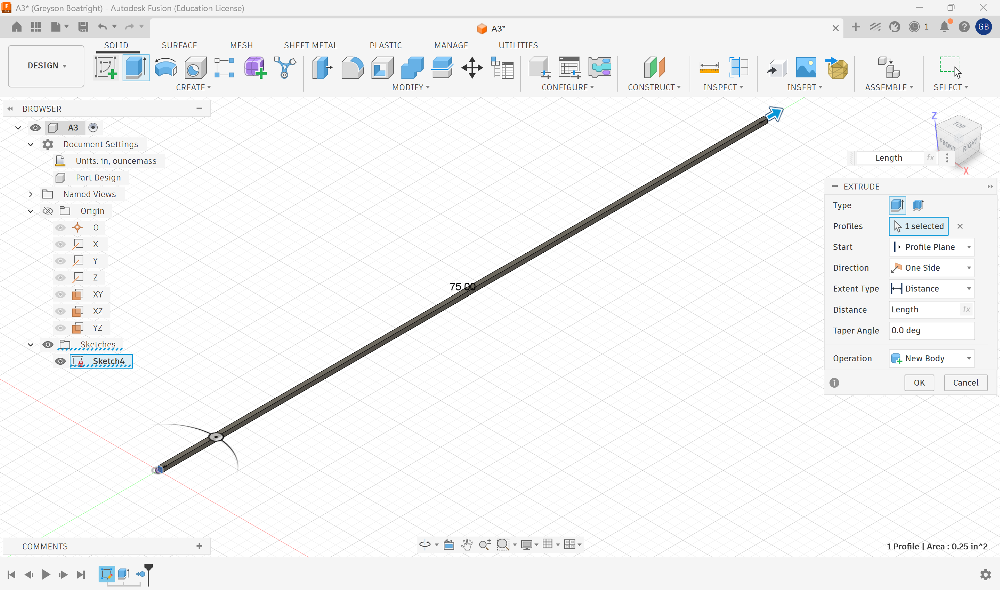
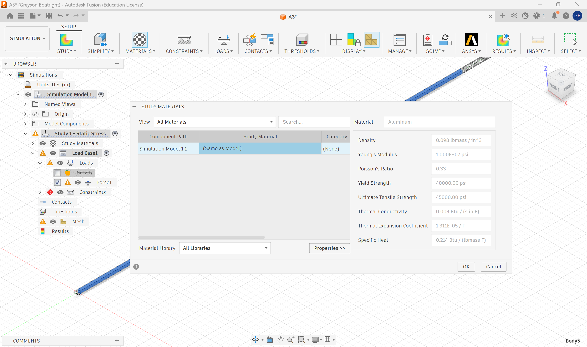
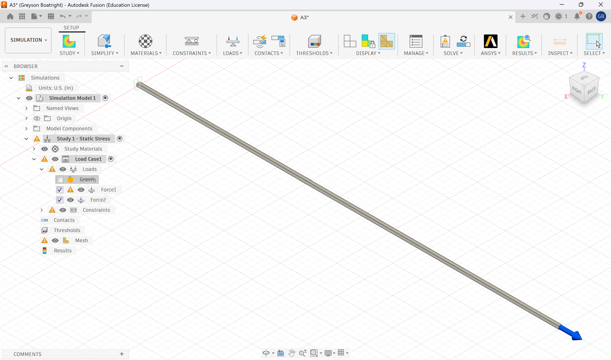
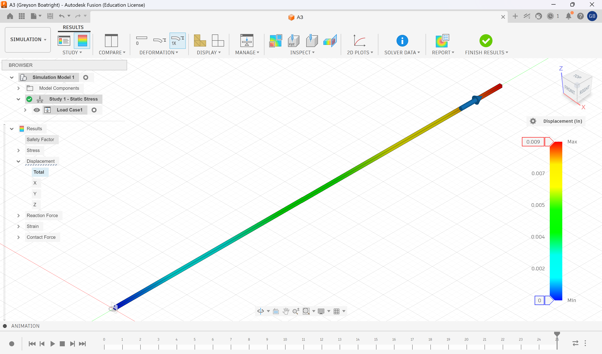
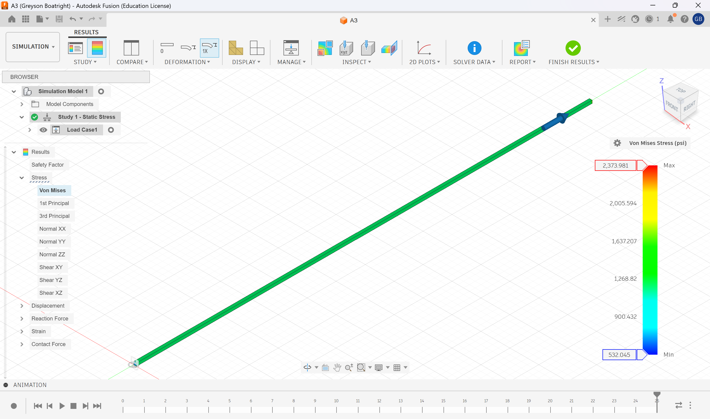
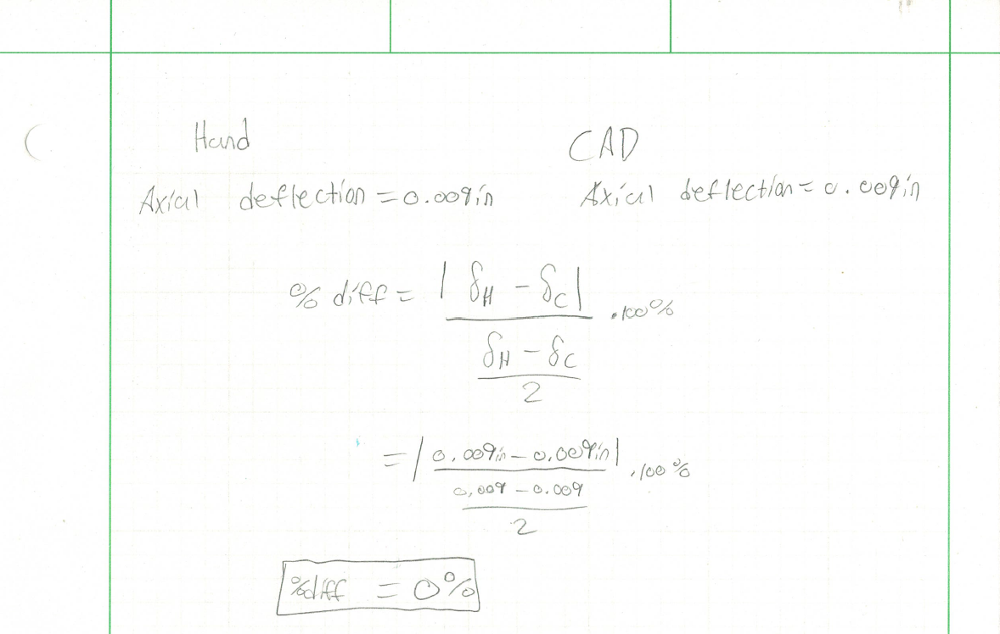

# A3 – [Topic]

## Objective
### Design Objective and Requirements
The goal of this assignment is to design a bar with a circular cross section given a set of values. Through those values and design requirements we will be able to find out information about that bar such as how long it is and we can look at properties of that bar through FEA like stress and similar properties. The design requirements of this bar is a direct load between 300-500lb is applied to it. Our make axial deflection is .009 inches, and it must be made out of aluminum which Young's Modulus must be within 8.5-11.5 x 16^6 psi.

## Analyze
### Parametric design
The first step in designing was to draw a simple shape of what I wanted the bar to look like, so I drew a simple square bar where the cross section was a square with equal sides and had a length (L). For my parameters I chose a Force (F) of 300lb, my Young's Modulus (E) for aluminum was 10 x 10^6 psi, the area (A) I wanted to have was 0.25in, and my max deflection was 0.009in. So using the direct tension elongation equation in the Machinery's Handbook I solved for Length which came out to be 75in.

## Decide
### CAD
I then opened up Fusion to start my parametric design on CAD. I opened up parameters started setting my variables with their assigned value I gave them and then I wrote the equation for length where Length = (Deflection * side^2 * Young's Modulus) / Force. Once i set those parameters I started a sketch with a rectangle and set one side to equal the side variable of 0.5in. I then made an equal constraint of that side of the other to make a square. Furthermore I finished the sketch and extruded and I set that dimension equal to my length variable which came out to be 75in which matched my hand calculation.

### Material
I decided to use the aluminum in Fusion because it had a Young's Modulus of 10 x 10^6 psi. This was where I wanted to be since my limits were supposed to be between 8.5-11.5 x 10^6 psi. I applied this material to the body.

## Communicate
### FEA
It was now time to conduct a FEA on my bar that I used to generate its geometry. I set a constraint on one of the faces on one side and I set a 300 lb load in the axial direction on the other face creating a tension on the bar. With simulation I needed to set my mesh so I went into settings and made the model base size 3% and the refinement control to high. I then ran the study and came up with my deflection map which maxed at 0.009in which was in my range. Then I generated a von Mises Stress map and our max stress was 2,373.981 psi which was significantly below our strength of aluminum (40 ksi). The safety factor could then be calculated (FS= failure strength /  applied stress) = 40,000 psi / 2,373.981 psi = 16.85 for our factor of saftey.

### Reflection 
I compared my hand calculation to the calculation from Fusion for axial deflection and our calculations were the same. the percent difference was 0%. I expected this because the geometries and formulas used in calculation were the same on CAD and on hand. I think if I had used a different mesh these numbers would not have matched because the nodes would have been too big on the model. However because I refined the mesh the simulation ran much more accurately. Honestly, I think I would trust hand calculation more because I used knowledge of statics and materials to calculate while reference the machinery's handbook, there's a couple other factors in CAD like mesh that can report different calculations.

### Pin Hole
Using a 0.40in diameter hole all the way through my bar lets see what the peak stress at the hole would be. Referencing the Machinery's handbook 32nd edition pages 206-210. to calculate out stress concentration factor K for a flat bar in torsion would be K= 1+q(kt-1). Now because Aluminum is a ductile material I would use q=0 which would make our stress concentration factor, which would make the peak stress at the hole the same and it would pass our saftey factor.

### Lessons learned
I learned how parametric design can be used to model, this is something we did in CAD for Mechanical engineers last semester and didn't really see how it could relate to anything other than being a shortcut for repetitive shapes/models. But now I can see that it can allow us as engineers to draw comparisons and run simulations quickly to decide the best material, area/shape, and geometry depending on our load. I spent five hours working on this assignment.

### Modify Design Parameters
Lets say I changed my force to 400 lb, my height to 1in and width to 1in and kept the material of aluminum the same , meaning Young's Modulus for aluminum (10x10^6) remains the same. I think the length will increase because I raised the force which makes the length larger because its a bigger fraction and the area increases in the numerator and its directly proportional. I did the calculation on my calculator and our new length would be 225in

### CAD File
[Download the Fusion Bar](./A3.f3d)

