# A5 – [Bracket Design]

## Objective
### Objectives and Requirements.
The task is to design a bracket that will hold a horizontal force applied symmetrically by a strap (see picture below). I will design each bracket so that its dimensions are design for different fit classes. I am given a rigid T beam with dimensions a, b, and c for which each has their own criteria of fit. I will be using a safety factor of 4, the parameters of the load are to be between 500-800 lbf, and lastly I will chose either aluminum, steel, or titanium for the bracket. With our requirements I will also make certain assumptions and utilize knowledge of statics and solid mechanics for the design of my bracket. I am going to use a 500lb load and Steel (ASTM A36).
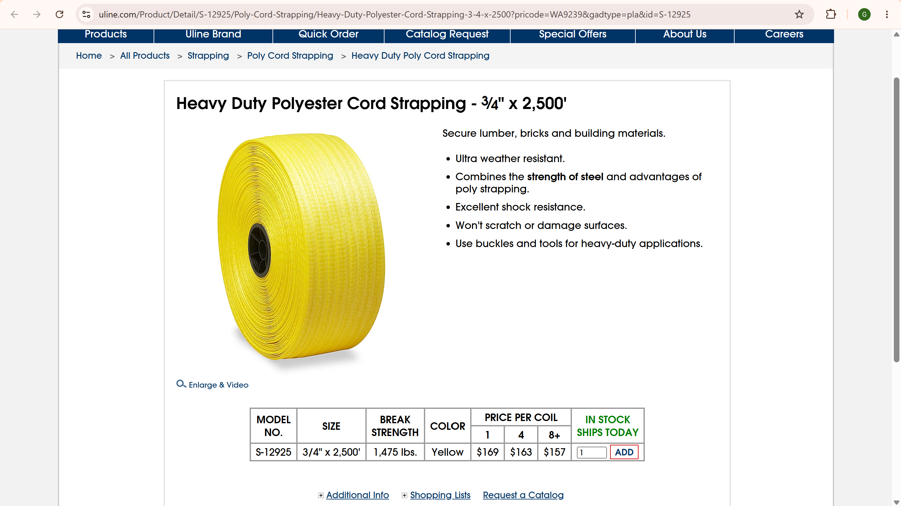
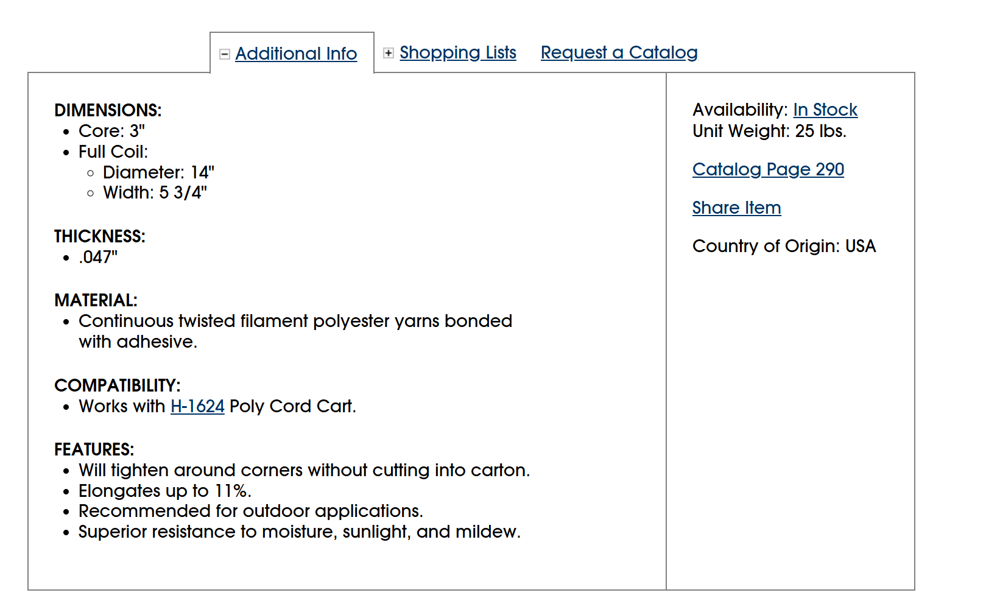
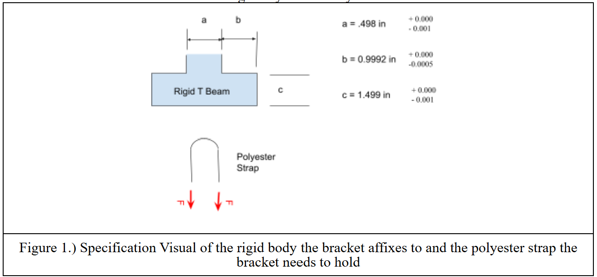
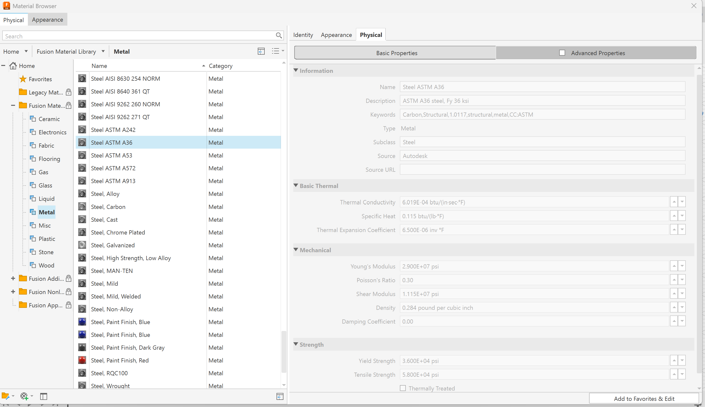

## Analyze

### Feature A
#### Stress Analysis: A
The first step in our analysis was to start with feature A and work our way through feature by feature, I drew a FBD of feature A and I modeled it as a cantilever beam. I wrote down my knowns, unknowns and assummptions about feature A, from here I was able to identify the moment and determined that I was looking for the diameter. The length in the our analysis really didn't matter for this portion since I solve for diameter=(32M/PI*allowable stress)^1/3. Solving this the diameter came out to be 0.7515in which I rounded up to 0.8125in.
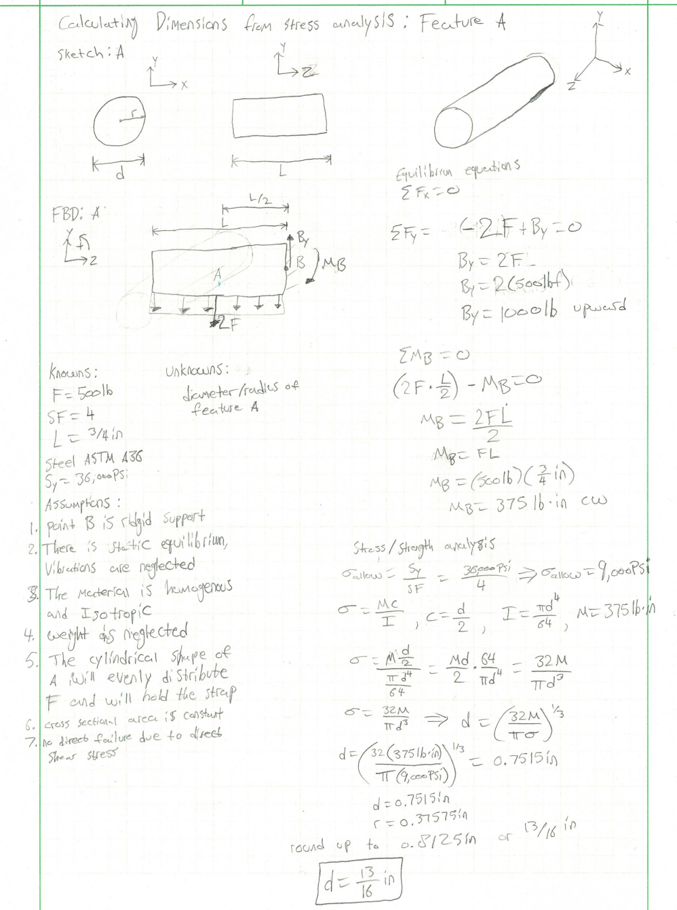

#### Stiffness Analysis: A
For the stiffness analysis of feature A I followed the same procedure as feature A. I wrote down the knowns, unknowns, assumptions, and I used the same FBD as before. The difference in this step was our equation which was d=(8wL^3/E*PI*deflection)^1/4. Now see in this equation the length does matter because it is in the numerator and is proportional to our diameter. I decided to put the length of 0.75in for the length since that was the width of the strap. Plugging in our values was see the result is 0.29338in. Which is significantly less that our strength analysis. A key note here is the equation is to the fourth root so even if we increase the length it is still well below our strength minimum length.
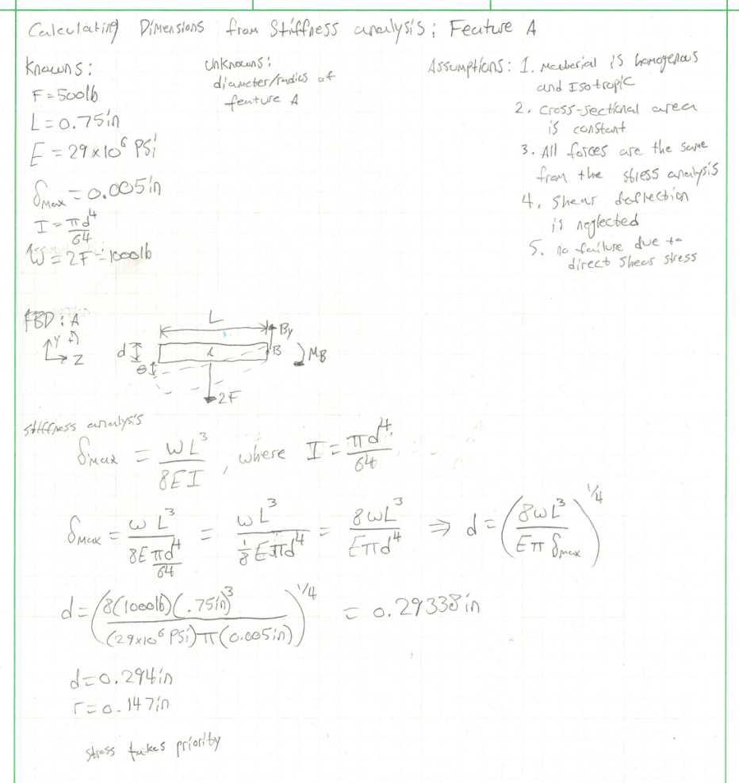

### Feature B
#### Stress Analysis: B
Now that Feature A was out of the way I moved onto feature B, which I quickly realized that most of these features had to be done in sequential order due to the load path throughout the entire part and our dimensions from previous features drove some of our knowns for the next feature I was calculating for. Like before I wrote my knowns, unknowns, assumptions, and drew a FBD only this time I treated B as an axially loaded bar. Our strength equation then became. h=P/b*allowable stress. and the h came out to be 0.13675in which I rounded up to 0.1875in.
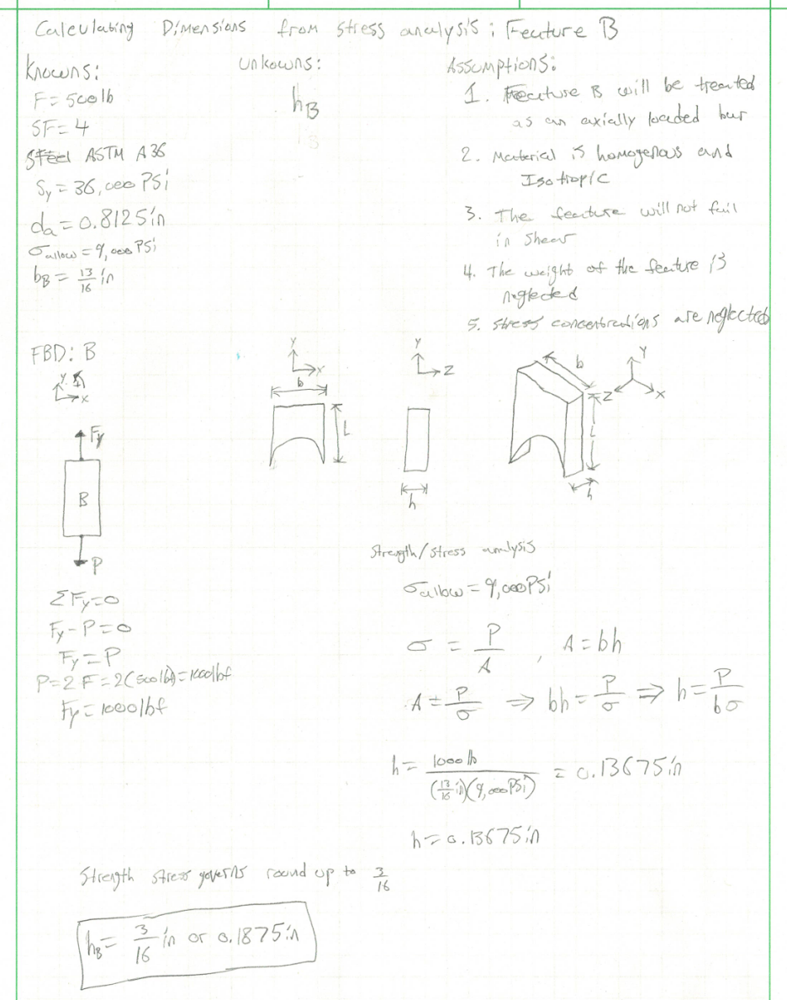

#### Stiffness Analysis: B
With stiffness analysis of feature B our equation was h=PL/b*E*max deflection) I started early on establishing a coordinate system because this was crucial to understanding which direction the load was in and how to determine which dimensions were assign their appropriate variables. As you can see below the length was important for this step and I decided to use a length of 0.75in. Plugging in our values our h came out to be 0.0063in.
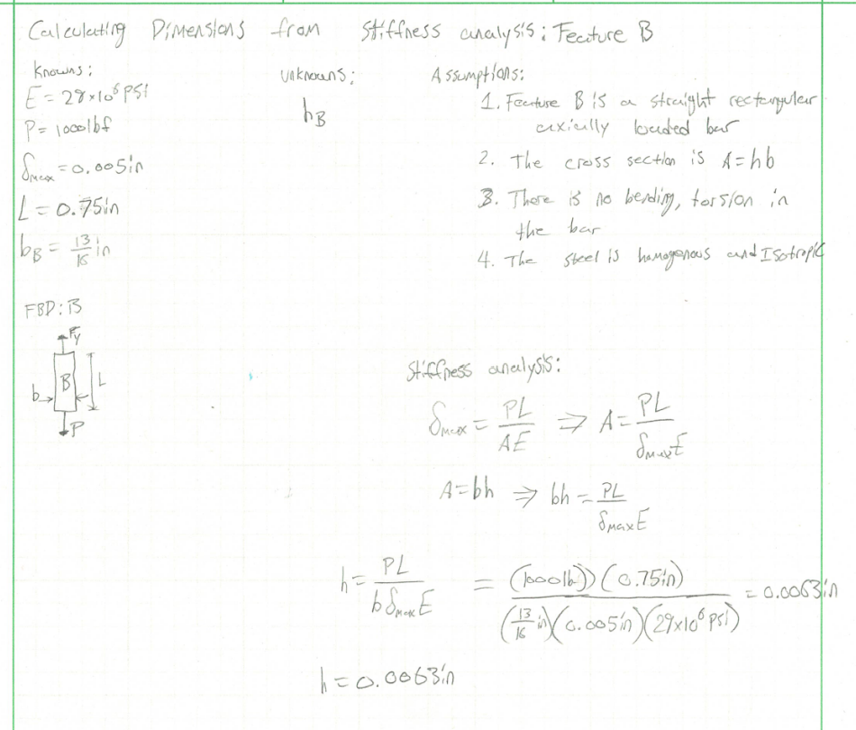

### Feature C
#### Stress Analysis: C
Feature C was treated as a simply supported beam with a concentrated load at the center. I wrote down my knowns, unknowns, assumptions, and generated my FBD. Using the stress equation referenced from the book and rearranging variables I got d=(1.5PL/b*allowable stress)^1/2. Pluggin in the values resulted in d being exactly 0.25in.
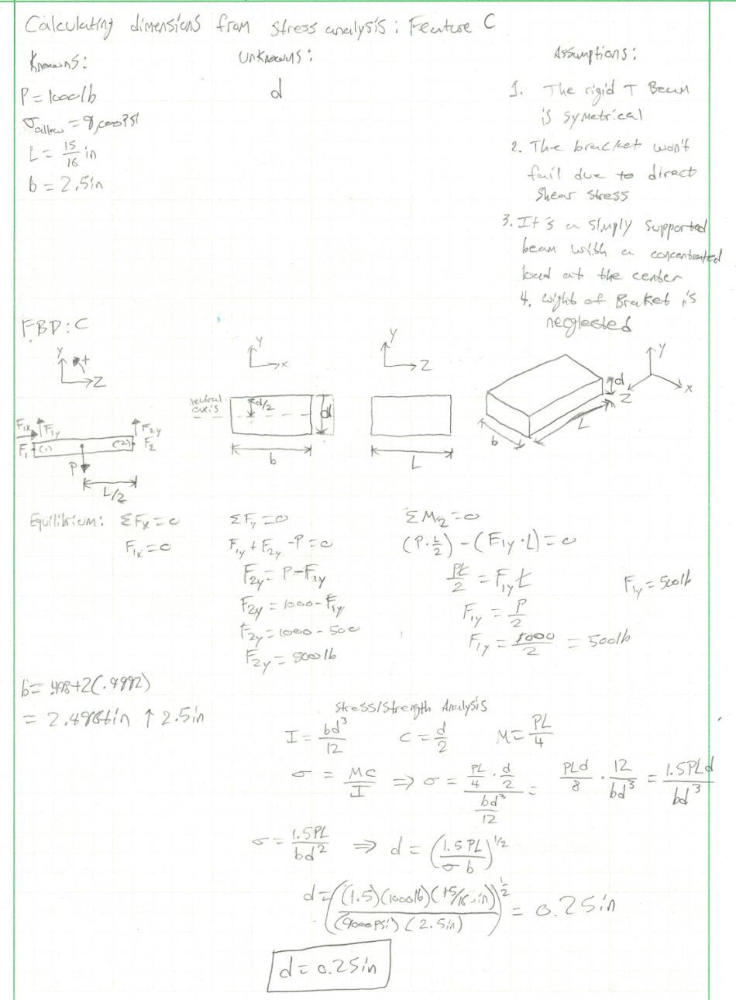

#### Stiffness Analysis: C
The stiffness analysis of feature C was relatively the same. I followed the same steps as before and the formula max deflection=WL^3/48EI was used as reference from the machinery's handbook. rearranging for d and the number I got for d came out to be 0.0828in. I started to notice about here that for most of these feature the stress was typically more but I was curious to see if this was always true.
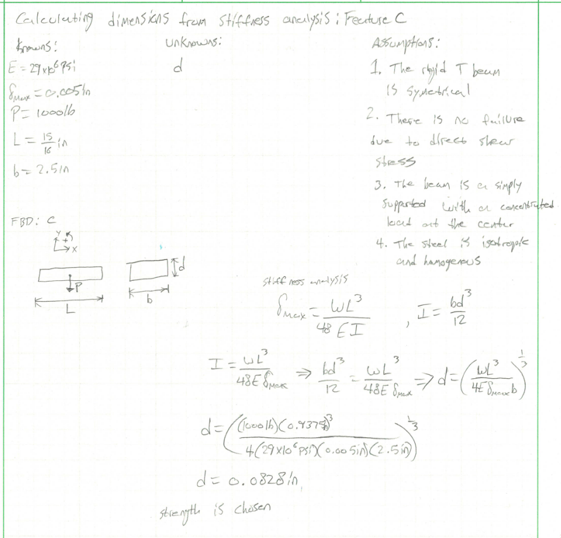

### Feature D
#### Stress Analysis: D
Feature D is where things got a little bit tricky as I was trying to determine how to model feature D. I started with knowns, unknowns, and assumptions. With feature D and like C according to our model the length was the same as features C and E but I wanted to ensure it would work. As well the d dimension of feature D was essentially set because of the fit to the T beam. I decided to treat it as an axially loaded bar and plugged in the values for D to got 0.05925in, and rounded it up to 0.125in.
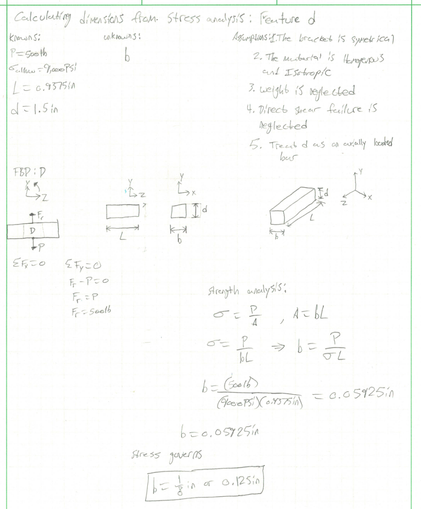

#### Stiffness Analysis: D
In the stiffness analysis for D, just like the stress analysis the length and dimension d were more of design/fit geometry. The equation was nonetheless the same as previous stiffness analysis and our max deflection of 0.005in was used again like all the other features. this time the b dimensions was 0.00551in. That was over 50 thousands of a difference from the stress analysis.
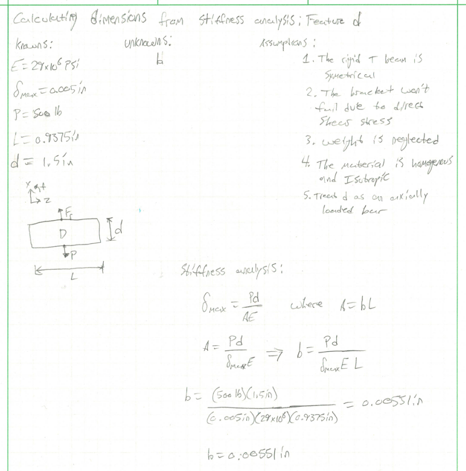

### Feature E
#### Stress Analysis: E
Lastly was feature E, and for feature E I wrote down all the knowns, unknowns, and assumptions about the feature. For the free body diagram I treated it as a cantilever beam. I determined that I wanted to find dimension d. I solved for d algebraically and the result after the values were in was 0.559in which was rounded to 0.5625in.
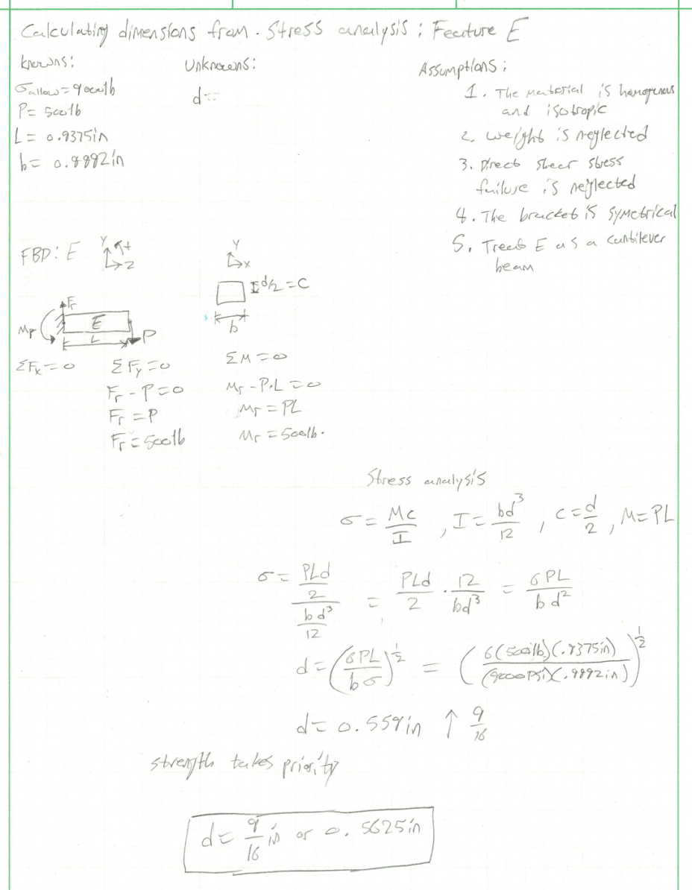

#### Stiffness Analysis: E
One of the things that made feature E so unique for both stress and stiffness analysis was the fit. According to the dimensions of the T beam our b dimesnion had to be 0.9992in based on the fit of the bracket and beam. I decided to solve for d then and the d dimension came out to be 0.224in.
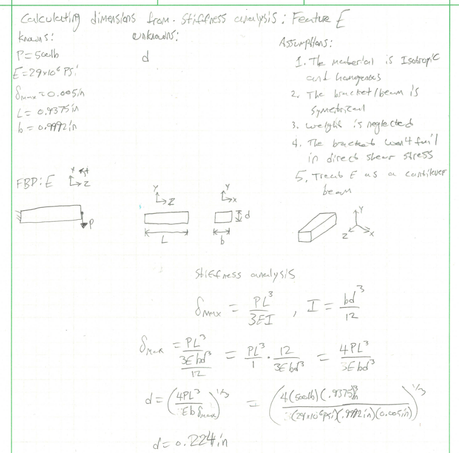

## Decide

### Sketches
Below are some multi-view sketches of both the stress and stiffness analysis, some key items to note are the overall dimensions of both. Stiffness having a maximum deflection of 0.005in allowed the features to be much smaller while the stress called for dimensions to be larger. For some of these dimensions especially on A and B features, I wanted to go with nominal dimensions since the decimals were often repeating and those were the minimums.
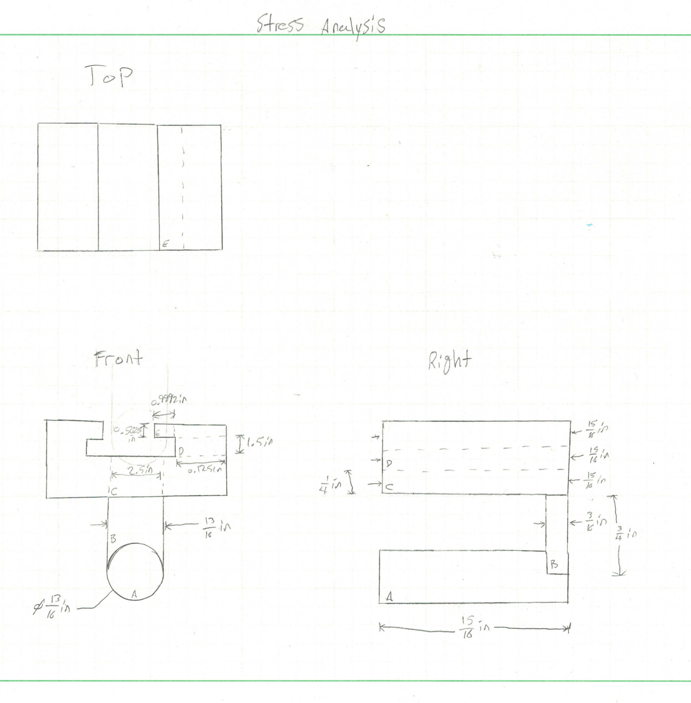
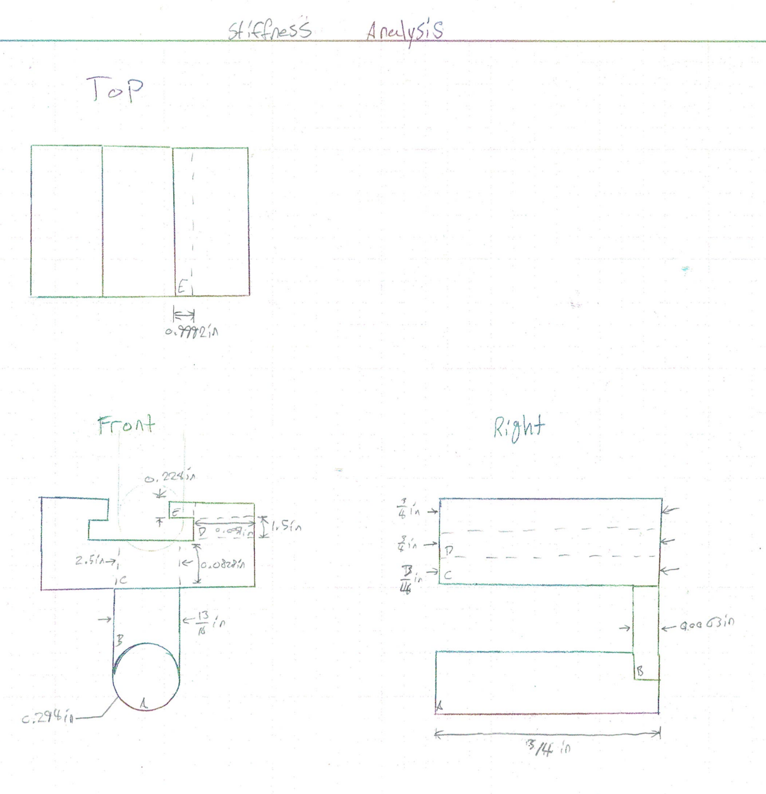

## Communicate

### Lessons Learned
For feature A I was solving for the diameter in both the stress and stiffness analysis. For the stress our minimum diameter was to be 0.7515in which I rounded up to 0.8125. On the other end according to the stiffness analysis the minimum diameter was 0.29338in. From raw minimum dimensions this was a difference of 0.45812in, that's very close to almost a half inch of diameter. In this case the strength diameter governed the final dimension. Finding the diamter was important for those but it played a huge factor in finding the dimensions of feature B. If I did not know the diameter of feature A then identifying the we'll call it width or dimension b for feature B then I would have had two unknowns to solve for. But for a more aesthetically pleasing and smooth transtion I chose the width of feature B to be the same as the diameter of feature A. I spent 9 hours on this assignment.

### Fits
Finally I had to design a link that could be placed onto feature A and have the same load applied to it. I wrote down the knowns, unknowns, and assumptions about the link. I also knew previously that the diameter of the shaft from feature A was 13/16in, additionally we were given a shaft of 1in in diameter for the other holes. The length in this case I made 3in because that was a decently proportional length to the holes. I treated the FBD as an axially loaded bar and conducting a strength and stiffness analysis. the strength A came out to be 0.05556in^2 and the stiffness area came out to be 0.0103in^2. The smaller cross sectional area was the stiffness. I referenced pages 650-654 from the machinery's handbook to determine the fit of feature A on the hole to shaft. the shaft had a grade of 5 which meant we could cylindrical grind the shaft to get within tolerance and our grade 6 for the hole meant we could ream it. we needed a sliding fit which was determined to be an RC2 class which is the table I referenced. For the 1in shaft it was to be a FN1 fit, so on page 659 that told me that the hole could be reamed and the shaft could be cylindrically grinded to meet our required tolerance according to their grade.

