# A6 – Bracket Drawing

## Objective

### Objectives & Requirements
In this assignment I need to create a model and multi-view engineering drawing of the bracket I designed previously. In this model and drawing I need to ensure that it meets the previously calculated strength and stiffness requirements. This will allow me to combine skills I have learned from previous topics such as parametric modeling and engineering drawings to communicate technical information and conduct further analysis of the designed bracket.

## Analyze

### Parametric Design
For the parametric design of the T-beam bracket, I designed each feature with dimensions I calculated in A5 and I went through features sequentially in Fusion. I started by assigning Steel ASTM A36 to the model and for each feature I inputted the correct dimension to the variables, after assigning the variables I created a sketch of the features and extruded them all while assigning the variables to the dimensions. When creating my user defined functions it was more difficult to write an equation for my dimensions because in A5 a lot of my dimensions were rounded up from the calculated requirement. However because I assigned variables to all the dimensions it allows me to very easily change the whole models or a specific feature without having to redraw and extrude a feature.
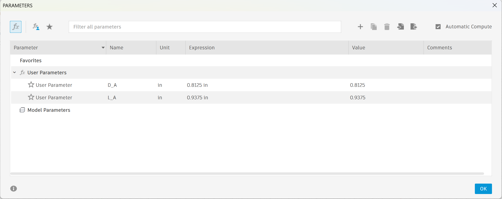
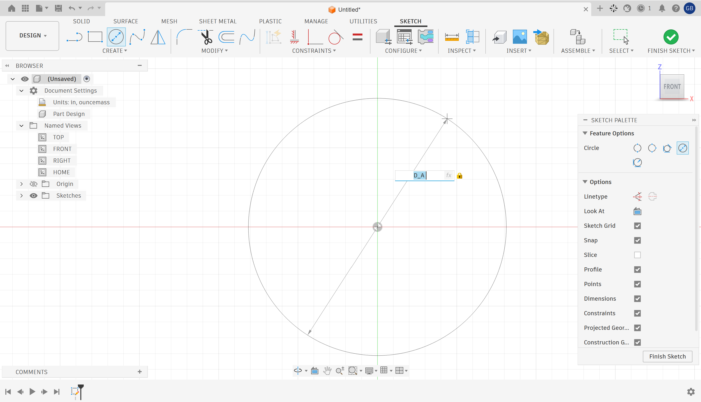
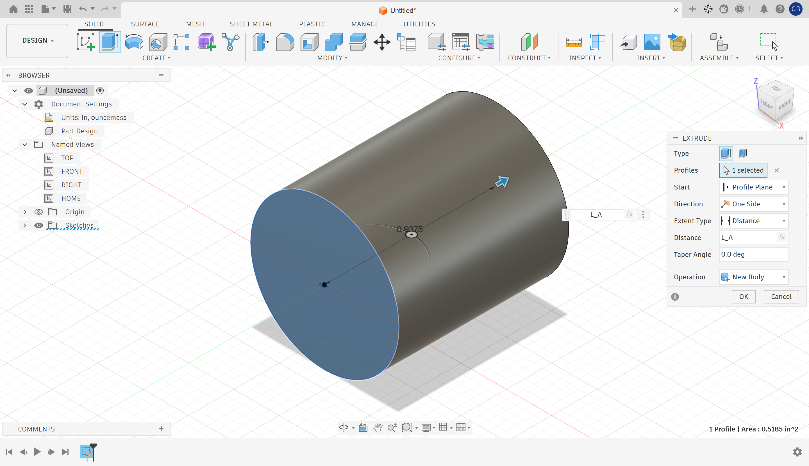
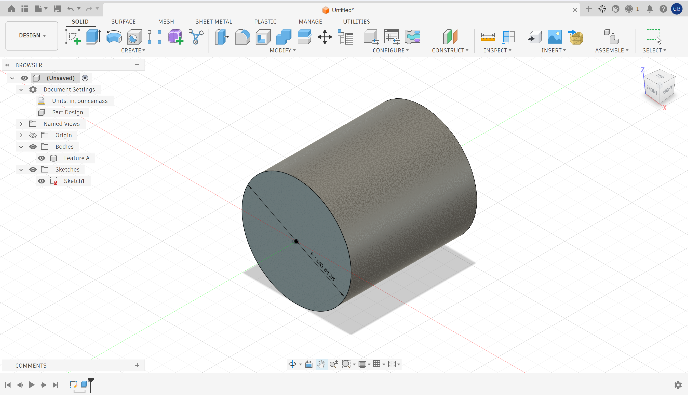
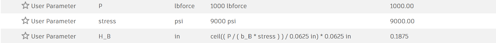
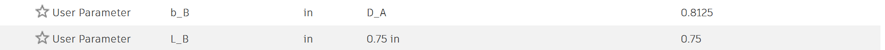
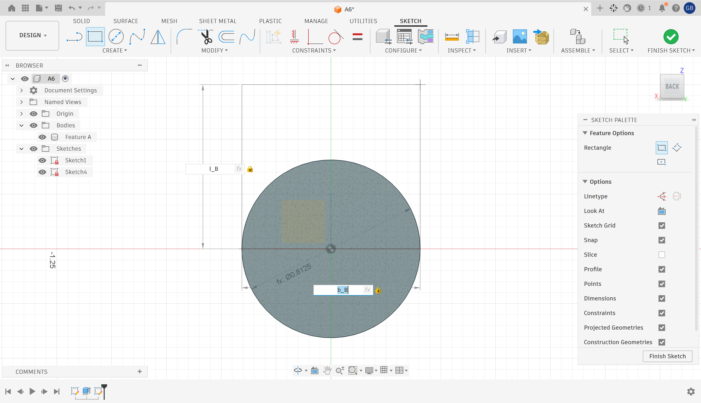
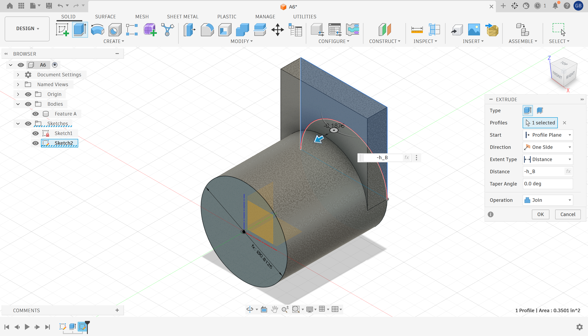
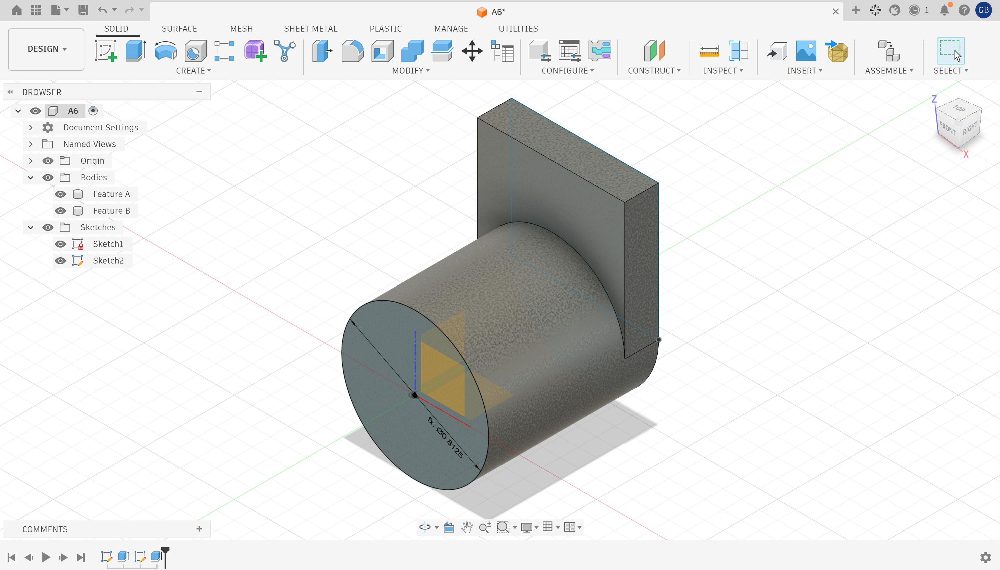
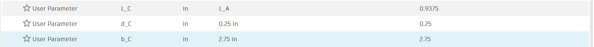
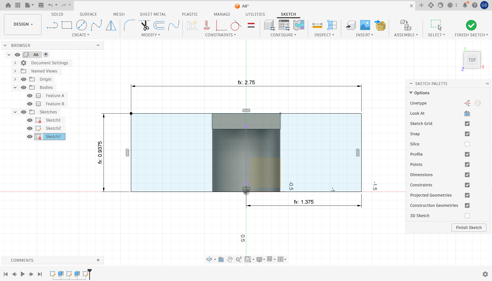
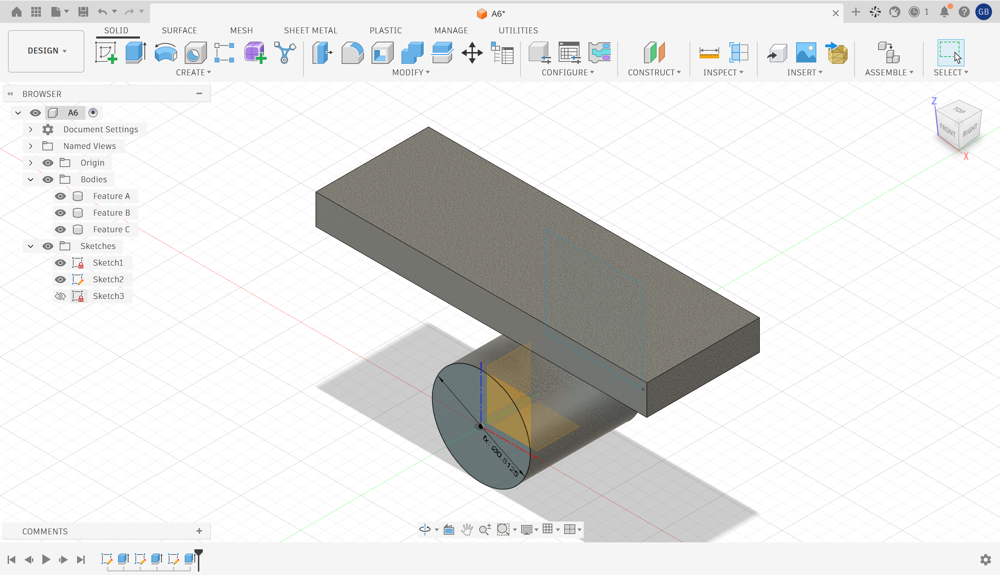
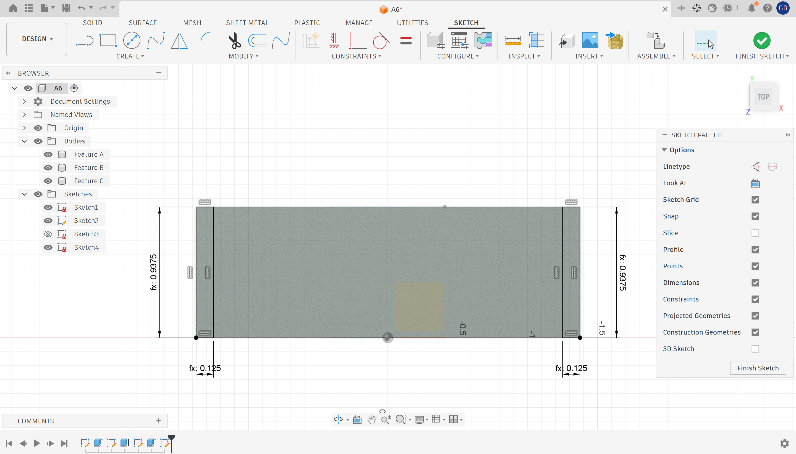
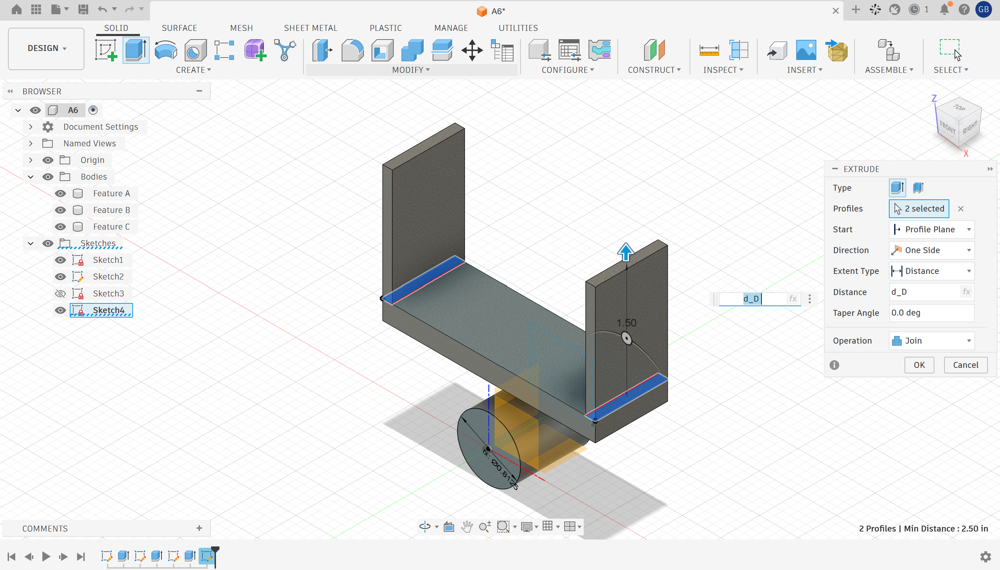
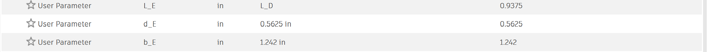
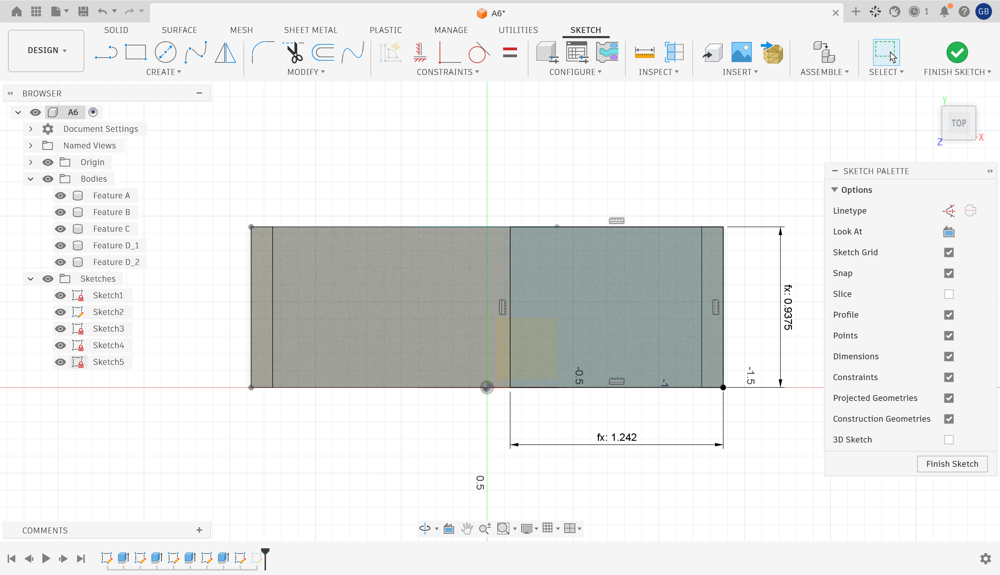
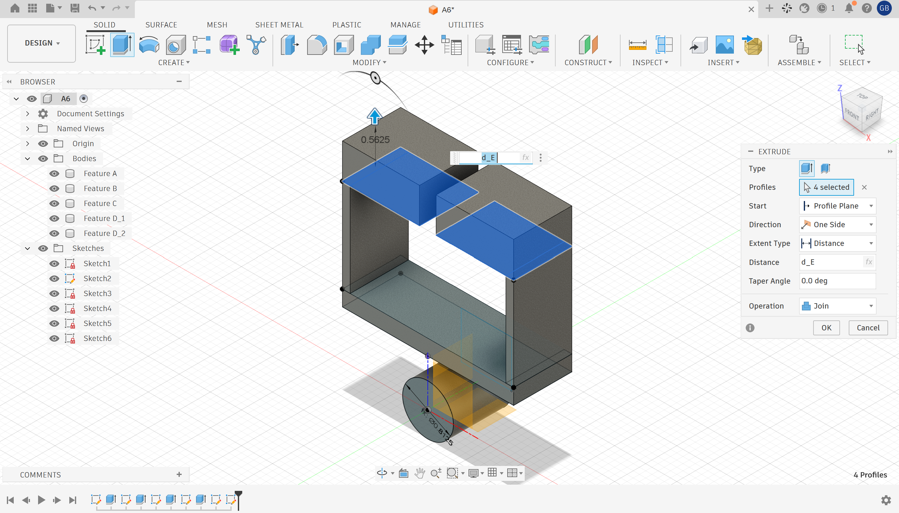
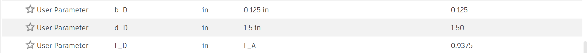

## Decide

### Drawing
I generated a drawing of the bracket in Fusion using third angle projection, I assigned dimensions that were essential to the model and I referenced the machinerys handbook to give tolerances to the most important fits of the drawing. I did not have the college of engineering templete for drawings in fusion so I tried to model my blocks similar to it and included the tolerance block.
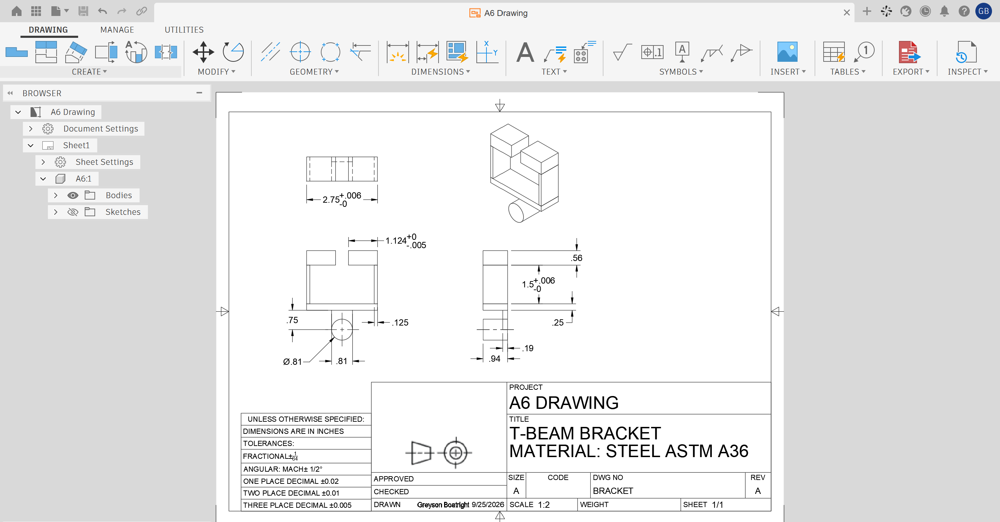

## Communicate

### Reflections

### Lessons Learned

### 2157 Students only: Drawings
#### Parametric Design
#### Drawing
#### Reflection

picture format

cad format

### CAD File
[Download the Fusion Bar](./a3-1.f3d)
